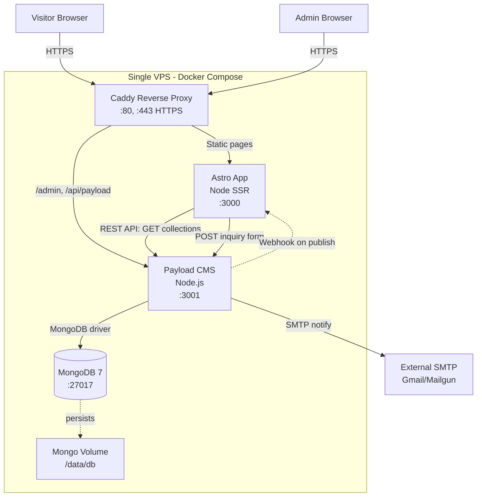
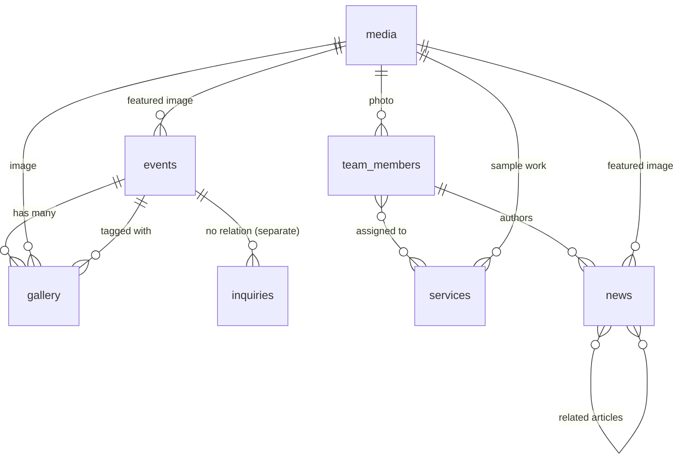

# Technical Plan — RIKAS Indo Technology Event Organizer Website

> **The "how" artifact.** Translates the product spec into technical decisions, architecture, data model, and contracts. Every choice has a rationale that traces back to a requirement.

**Branch**: `001-rikas-eo-website`
**Date**: 2026-06-25
**Spec**: [`.prd-spec-kit/spec.md`](./spec.md)
**Constitution**: [`.prd-spec-kit/constitution.md`](./constitution.md)

---

## Summary

Build a self-hosted, content-managed marketing website for RIKAS Indo Technology EO. Astro 5 (static-first, islands architecture) frontend renders all pages server-side at build time, reading content from Payload CMS 3 (Node.js, MongoDB-backed) via REST API. Payload admin at `/admin` allows non-technical operators to manage events, team, services, news, gallery, and inquiries. Docker Compose orchestrates the full stack (Astro app + Payload server + MongoDB + Caddy reverse proxy) on a single VPS. Dark theme inspired by TeamLiquid.com with RIKAS brand navy `#1b2a51` as primary color. All content in Indonesian. No third-party tracking. Static export + webhook-triggered rebuilds keep the marketing site fast while staying editable via CMS.

---

## Technical Context

**Language/Version**: TypeScript 5.6+ on Node.js 20+ LTS

**Frontend Framework**: Astro 5.x with React 19 islands for interactive components (lightbox, carousel, form validation)

**Primary Dependencies**:
- `@astrojs/react` — React 19 integration for islands
- `@astrojs/tailwind` — Tailwind 4 CSS
- `tailwindcss` v4 — utility-first styling
- `sharp` — server-side image optimization (AVIF/WebP)
- `@payloadcms/db-mongodb` — Payload CMS 3 MongoDB adapter
- `@payloadcms/next` — Payload CMS 3 (Next.js-based, embedded in Astro via Node sidecar)
- `nodemailer` — SMTP for inquiry notifications
- `zod` — runtime validation for form payloads
- `lucide-react` — icon set (lightweight, tree-shakeable)

**Storage**: MongoDB 7.x (single-node, self-hosted, Docker container) — Payload CMS collections (Events, TeamMembers, Services, News, Gallery, Inquiries, Media, Users)

**Testing**: `vitest` for unit tests, `playwright` for E2E, `@axe-core/playwright` for accessibility audits

**Target Platform**: Linux server (Docker containers), modern browsers (Chrome 120+, Firefox 120+, Safari 17+, Samsung Internet 22+)

**Project Type**: `web-application` (frontend + CMS backend + DB)

**Performance Goals**:
- LCP < 2.5s on simulated 4G (Lighthouse mobile)
- FCP < 1.5s on simulated 4G
- JS bundle < 200KB gzipped per route
- API p95 < 300ms for CMS REST endpoints
- Static rebuild on content publish < 60s

**Constraints**:
- Single VPS, 2GB RAM, 20GB disk (tight memory budget)
- Mobile-first (320px+ baseline)
- Indonesian language only
- No third-party tracking (Meta Pixel, GA4)
- MongoDB memory-limited to 512MB
- Astro Node adapter for SSR (some dynamic routes: contact form submit)

**Scale/Scope**:
- ~10k monthly visitors expected
- ~200 events, ~30 team members, ~50 services, ~100 news articles
- ~1000 gallery photos
- ~50 inquiry submissions per month
- Admin: 2-3 users

**Security/Compliance**:
- OWASP Top 10 mitigation (XSS via Payload's React-based admin, CSRF via Payload's built-in)
- Rate limiting on form submission (5/IP/min)
- Honeypot field for bot prevention
- HTTPS via Let's Encrypt (Caddy auto)
- Admin panel behind auth + IP allowlist (optional, configurable)
- No PII storage beyond inquiry form (name, WhatsApp, email, message)

---

## Constitution Check

> **GATE: Must pass before Phase 0 research. Re-check after Phase 1 design.**

| Principle | Status | Evidence / Justification |
|---|---|---|
| **I. Mobile-First Performance** | ✅ Compliant | Astro SSG + islands = minimal JS; Tailwind mobile-first utilities; AVIF/WebP via Sharp; LCP < 2.5s target |
| **II. Content-Authenticity** | ✅ Compliant | Payload CMS = real content only, draft/publish workflow, no mock data in production |
| **III. Bilingual-Ready (Indonesian-First)** | ✅ Compliant | All content in Indonesian; Astro i18n routing ready; English placeholder routes disabled in v1 |
| **IV. CMS-First, Static-When-Possible** | ✅ Compliant | Payload CMS for all content; Astro SSG for marketing pages; webhook on publish → rebuild |
| **V. No-Account, No-Tracking Privacy Baseline** | ✅ Compliant | No visitor accounts; no Meta/GA pixels; only self-hosted Plausible or server-log analytics |
| **VI. Self-Hosted, Vendor-Light Hosting** | ✅ Compliant | All components self-hosted (Astro, Payload, MongoDB, Caddy); no SaaS dependencies |
| **VII. Visual Hierarchy Mirrors TeamLiquid** | ✅ Compliant | Dark theme primary; sidebar widgets planned; content-dense layouts; brand color `#1b2a51` extracted from logo |

**No violations. All 7 principles compliant.**

---

## Project Structure

### Documentation (`~/rikas-website/.prd-spec-kit/`)

```text
.prd-spec-kit/
├── constitution.md          # Project principles
├── prd.md                   # Business case (this PRD)
├── spec.md                  # Product spec (user stories, FR, SC)
├── checklist.md             # Quality validation (83 checks, all passed)
├── plan.md                  # This file (technical decisions)
├── data-model.md            # MongoDB collections + indexes
├── contracts/
│   ├── cms-rest-api.md      # Payload REST endpoints
│   └── form-schema.md       # Zod schemas for forms
├── research.md              # Tech decision research log
├── tasks.md                 # Ordered task breakdown
└── audit-ecc-report.md      # ECC cross-artifact audit (generated)
```

### Source Code (`~/rikas-website/`)

```text
rikas-website/
├── apps/
│   ├── web/                       # Astro 5 frontend
│   │   ├── src/
│   │   │   ├── components/
│   │   │   │   ├── brand/         # Logo, navbar, footer
│   │   │   │   ├── events/        # EventCard, EventGrid, EventFilters, EventCarousel
│   │   │   │   ├── services/      # ServiceCard, ServiceGrid
│   │   │   │   ├── team/          # TeamMemberCard, TeamMemberGrid, DepartmentGroup
│   │   │   │   ├── news/          # ArticleCard, ArticleGrid
│   │   │   │   ├── gallery/       # MasonryGrid, Lightbox
│   │   │   │   ├── contact/       # ContactForm, InquiryTypeSelector
│   │   │   │   └── ui/            # Button, Card, Badge, Skeleton
│   │   │   ├── layouts/
│   │   │   │   ├── BaseLayout.astro
│   │   │   │   ├── EventLayout.astro
│   │   │   │   └── AdminLayout.astro
│   │   │   ├── pages/
│   │   │   │   ├── index.astro                  # Home (hero + 3 events carousel + services preview)
│   │   │   │   ├── tentang.astro                # About RIKAS
│   │   │   │   ├── event/
│   │   │   │   │   ├── index.astro              # Events list (upcoming/past tabs + game filter)
│   │   │   │   │   └── [slug].astro             # Event detail
│   │   │   │   ├── layanan/
│   │   │   │   │   ├── index.astro              # Services grid
│   │   │   │   │   └── [slug].astro             # Service detail
│   │   │   │   ├── tim/
│   │   │   │   │   ├── index.astro              # Team grid (grouped by department)
│   │   │   │   │   └── [slug].astro             # Team member profile
│   │   │   │   ├── berita/
│   │   │   │   │   ├── index.astro              # News list (paginated)
│   │   │   │   │   └── [slug].astro             # Article detail
│   │   │   │   ├── galeri.astro                 # Gallery (masonry + lightbox)
│   │   │   │   ├── kontak.astro                 # Contact form
│   │   │   │   ├── admin/                       # Payload admin mount (proxy to Payload server)
│   │   │   │   ├── api/
│   │   │   │   │   ├── contact.ts               # POST inquiry endpoint
│   │   │   │   │   ├── health.ts                # GET /health endpoint
│   │   │   │   │   └── rebuild.ts               # POST webhook trigger (Payload → Astro rebuild)
│   │   │   │   └── 404.astro                    # Not found
│   │   │   ├── styles/
│   │   │   │   └── globals.css                  # Tailwind 4 base + brand tokens
│   │   │   ├── lib/
│   │   │   │   ├── cms.ts                       # Payload REST client
│   │   │   │   ├── i18n.ts                      # Indonesian strings
│   │   │   │   ├── seo.ts                       # Meta tag + OpenGraph helpers
│   │   │   │   └── validation.ts                # Zod schemas
│   │   │   └── env.d.ts
│   │   ├── public/
│   │   │   ├── favicon.svg
│   │   │   ├── og-image.png                     # Default OG image (1200x630)
│   │   │   └── robots.txt
│   │   ├── astro.config.mjs                     # Astro config (Tailwind, React, output: server)
│   │   ├── tailwind.config.ts
│   │   ├── tsconfig.json
│   │   └── package.json
│   │
│   └── cms/                       # Payload CMS 3 server
│       ├── src/
│       │   ├── collections/
│       │   │   ├── Events.ts                  # Event collection
│       │   │   ├── TeamMembers.ts             # Team member collection
│       │   │   ├── Services.ts                # Service collection
│       │   │   ├── News.ts                    # News article collection
│       │   │   ├── Gallery.ts                 # Gallery photo collection
│       │   │   ├── Inquiries.ts               # Contact form submission collection
│       │   │   ├── Media.ts                   # Uploaded media
│       │   │   └── Users.ts                   # CMS admin users
│       │   ├── hooks/
│       │   │   └── notifyOnPublish.ts         # Webhook trigger on publish
│       │   ├── access/
│       │   │   └── roles.ts                   # Admin/Editor/Viewer role checks
│       │   ├── payload.config.ts              # Payload main config
│       │   └── server.ts                      # Payload standalone server (port 3001)
│       ├── tsconfig.json
│       └── package.json
│
├── packages/
│   └── shared/                   # Shared types/schemas
│       └── src/
│           ├── types.ts          # TS types matching Payload collections
│           └── schemas.ts        # Zod schemas (form, API responses)
│
├── docker/
│   ├── docker-compose.yml        # Full stack orchestration
│   ├── Dockerfile.web            # Astro app image
│   ├── Dockerfile.cms            # Payload CMS image
│   ├── caddy/
│   │   └── Caddyfile             # Reverse proxy config
│   └── mongo/
│       └── mongod.conf           # MongoDB config (memory limits)
│
├── scripts/
│   ├── seed.ts                   # Seed initial CMS content (admin user, sample event)
│   ├── backup.sh                 # Daily MongoDB dump
│   └── lighthouse-audit.sh       # Run Lighthouse CI
│
├── assets/                        # Brand assets (logo, mockups)
│   ├── rikas-logo-original.jpg   # Original logo (provided by user)
│   └── rikas-logo.svg            # SVG version (to be vectorized)
│
├── .env.example                   # Required env vars template
├── .gitignore
├── README.md                      # Project overview
├── package.json                   # Monorepo root (pnpm workspaces)
├── pnpm-workspace.yaml
└── tsconfig.base.json
```

**Structure Decision**: **Monorepo (pnpm workspaces)** with two apps (`web` for Astro, `cms` for Payload) sharing types via `packages/shared`. Astro reads from Payload's REST API at build time (SSG) and at request time (SSR for `/kontak` form submit). Payload runs as separate Node.js server, accessible at `/admin` via Astro reverse proxy. Docker Compose for orchestration.

---

## Architecture Overview



**Key architectural decisions:**

1. **SSG-first, SSR for dynamic routes**: Astro renders marketing pages at build time (events list, team grid, services) for max performance. SSR is used only for `/kontak` (form submission) and `/api/health` (healthcheck). Rationale: NFR-001 Lighthouse score ≥ 90 requires static-first; SSG pages are 10x faster than SSR.

2. **Astro + Payload as separate processes (not embedded)**: Astro calls Payload's REST API at build time via `getStaticPaths`. Rationale: Decouples content from presentation; Payload can be backed up independently; Payload's Next.js-based admin doesn't fit Astro's render model.

3. **MongoDB single-node (not replica set)**: Single-node with daily `mongodump` backups. Rationale: 2GB RAM budget; replica set needs 3 nodes minimum; single-node + backup meets NFR-005 (99.5% uptime) for a marketing site.

4. **Webhook-triggered rebuilds**: Payload `afterChange` hook fires HTTP POST to Astro's `/api/rebuild` endpoint on content publish. Rationale: Avoids cron polling; sub-60s content freshness; standard Astro pattern.

5. **Indonesian-only in v1, i18n-ready**: All strings centralized in `lib/i18n.ts` for future English. Rationale: NFR-014 i18n-ready without shipping English UI in v1; satisfies FR-054 Indonesian-only.

6. **Caddy as reverse proxy (not Nginx)**: Caddy's auto-HTTPS via Let's Encrypt + zero-config HTTP/2. Rationale: Simpler config; less surface area for misconfiguration; matches VPS-friendly stack.

7. **Tailwind 4 (not 3)**: Tailwind 4 has zero-config CSS variables, native CSS layer support, faster builds. Rationale: Modern tooling, future-proof, smaller output CSS.

---

## Tech Stack Decisions

### Decision 1: Astro 5 (not Next.js, SvelteKit, or Nuxt)

- **Choice**: Astro 5.x with React 19 islands
- **Rationale**: Static-first = best Lighthouse score; islands = JS only where needed (lightbox, form); lower attack surface than Next.js SSR-by-default
- **Alternatives considered**:
  - **Next.js 15**: Rejected — SSR-by-default fights NFR-001; more JS shipped; React Server Components complexity not needed
  - **SvelteKit**: Rejected — team familiarity with React/TS; smaller ecosystem for CMS integrations
  - **Nuxt 3**: Rejected — Indonesian developers more familiar with React
- **Status**: ✅ Approved

### Decision 2: Payload CMS 3 (not Strapi, Directus, Sanity, or Keystone)

- **Choice**: Payload CMS 3.x with MongoDB adapter
- **Rationale**: Self-hosted (Principle VI), TypeScript-native (matches our stack), MongoDB-backed (no SQL dependency), React-based admin (familiar), open-source MIT license, active development
- **Alternatives considered**:
  - **Strapi**: Rejected — v5 moved to cloud-first paid model; SQLite default not production-ready
  - **Directus**: Rejected — heavier admin UI; more database setup; overkill for 8 collections
  - **Sanity**: Rejected — SaaS-hosted (violates Principle VI)
  - **Keystone**: Rejected — smaller ecosystem; less active development
- **Status**: ✅ Approved

### Decision 3: MongoDB 7 (not PostgreSQL, MySQL)

- **Choice**: MongoDB 7.x, single-node, memory-limited to 512MB
- **Rationale**: Payload's first-class support; document model fits CMS collections; easy backup via `mongodump`
- **Alternatives considered**:
  - **PostgreSQL**: Would require Payload's Postgres adapter (newer, less battle-tested); overkill for 8 collections
  - **SQLite**: Not recommended for production in Payload; concurrent writes unsafe
- **Status**: ✅ Approved (with 512MB memory cap for VPS budget)

### Decision 4: Tailwind CSS 4 (not vanilla CSS, CSS Modules, styled-components)

- **Choice**: Tailwind CSS 4.x with custom design tokens for RIKAS brand
- **Rationale**: Utility-first = fast iteration; mobile-first utilities match Constitution §I; tree-shakeable = small output
- **Alternatives considered**:
  - **Vanilla CSS**: Rejected — slower iteration; harder to maintain consistency
  - **CSS Modules**: Rejected — verbose; no JIT compiler
  - **styled-components**: Rejected — runtime CSS-in-JS violates NFR-004 JS bundle budget
- **Status**: ✅ Approved

### Decision 5: Caddy 2 (not Nginx, Traefik)

- **Choice**: Caddy 2.x as reverse proxy with auto HTTPS
- **Rationale**: Zero-config Let's Encrypt; HTTP/2 + HTTP/3 by default; smaller config file
- **Alternatives considered**:
  - **Nginx**: Rejected — manual SSL cert renewal; verbose config
  - **Traefik**: Rejected — heavier (Go binary, dashboard); Docker-native but overkill for 3 services
- **Status**: ✅ Approved

### Decision 6: pnpm workspaces (not npm, Yarn, Turborepo, Nx)

- **Choice**: pnpm 9.x for monorepo
- **Rationale**: Fast installs, hard links save disk; workspace protocol for shared packages; smaller node_modules
- **Alternatives considered**:
  - **npm workspaces**: Rejected — slower; larger disk footprint
  - **Turborepo/Nx**: Rejected — overkill for 2 apps + 1 shared package
- **Status**: ✅ Approved

### Decision 7: Vitest + Playwright (not Jest, Cypress)

- **Choice**: Vitest for unit, Playwright for E2E + axe-core for a11y
- **Rationale**: Vitest = native ESM, Vite-powered (fast); Playwright = multi-browser, axe integration for WCAG
- **Alternatives considered**:
  - **Jest**: Rejected — slow ESM support; legacy config
  - **Cypress**: Rejected — single-browser testing weaker; axe integration via plugin only
- **Status**: ✅ Approved

---

## Data Model

> **Detailed schema in `data-model.md`. Summary here.**

### MongoDB Collections

| Collection | Key Fields | Indexes | Purpose |
|---|---|---|---|
| **events** | `_id`, `title`, `slug` (unique), `game[]`, `status`, `startDate`, `endDate`, `location{city,venue}`, `prizePool`, `description` (rich), `featuredImage`, `gallery[]`, `registrationWa`, `prefilledMessage`, `resultsUrl`, `publishedAt`, `createdAt`, `updatedAt` | `slug`, `startDate desc`, `status`, `game` (multikey) | Event showcase (US1) |
| **team_members** | `_id`, `name`, `slug` (unique), `role`, `department` (enum), `shortBio`, `fullBio` (rich), `photo`, `socialLinks{instagram,whatsapp,youtube}`, `portfolio[]`, `services[]`, `displayOrder`, `active` | `slug`, `department`, `displayOrder` | Team grid (US2) |
| **services** | `_id`, `title`, `slug` (unique), `icon`, `shortDescription`, `fullDescription` (rich), `sampleWork[]`, `assignedTeam[]`, `whatsappContact`, `displayOrder` | `slug`, `displayOrder` | Services grid (US2) |
| **news** | `_id`, `title`, `slug` (unique), `excerpt`, `content` (rich), `featuredImage`, `author`, `relatedArticles[]`, `status` (draft/published), `publishedAt`, `createdAt`, `updatedAt` | `slug`, `publishedAt desc`, `status` | News articles (US4) |
| **gallery** | `_id`, `image`, `caption`, `event` (ref), `tags[]`, `uploadDate` | `uploadDate desc`, `event` | Gallery photos (US4) |
| **inquiries** | `_id`, `name`, `email`, `whatsapp`, `inquiryType` (enum), `message`, `extraFields`, `status` (baru/dibaca/dibalas), `notes` (admin), `submittedAt` | `submittedAt desc`, `inquiryType`, `status` | Contact form submissions (US3) |
| **media** | `_id`, `filename`, `mimeType`, `filesize`, `width`, `height`, `alt`, `uploadedBy`, `uploadedAt`, `sizes{original,avif,webp,jpeg}` | `filename`, `uploadedAt` | All uploaded files (used by all collections) |
| **users** | `_id`, `email` (unique), `passwordHash`, `role` (admin/editor/viewer), `displayName`, `lastLogin`, `createdAt` | `email` | CMS admin users |

### Relationships



**See `data-model.md` for field types, validation rules, hooks, and access control matrix.**

---

## API Contracts

> **Detailed in `contracts/`. Summary here.**

### Astro → Payload REST (CMS data fetching at build time)

| Endpoint | Method | Purpose | Auth |
|---|---|---|---|
| `/api/events` | GET | List events (filter: status, game, date range) | Public |
| `/api/events/:slug` | GET | Get event details | Public |
| `/api/team-members` | GET | List team members (filter: department, active) | Public |
| `/api/team-members/:slug` | GET | Get team member details | Public |
| `/api/services` | GET | List services | Public |
| `/api/news` | GET | List articles (filter: status=published, pagination) | Public |
| `/api/gallery` | GET | List photos (filter: event, tags, pagination) | Public |

**See `contracts/cms-rest-api.md` for query params, response shapes, pagination contract.**

### Astro → Visitor (Form submission)

| Endpoint | Method | Purpose | Auth |
|---|---|---|---|
| `/api/contact` | POST | Submit inquiry form | Public + honeypot + rate-limit |
| `/api/health` | GET | Healthcheck | Public |
| `/api/rebuild` | POST | Webhook from Payload (rebuild trigger) | Shared secret |

### Request/Response Schemas

**Inquiry form POST `/api/contact`**:
```typescript
// Zod schema
const InquirySchema = z.object({
  name: z.string().min(2).max(100),
  whatsapp: z.string().regex(/^(\+62|62|0)8\d{8,11}$/),
  email: z.string().email().optional().or(z.literal('')),
  inquiryType: z.enum(['kemitraan', 'talent', 'event-booking', 'umum']),
  message: z.string().min(20).max(2000),
  // Type-specific optional
  budgetEstimate: z.string().max(100).optional(),
  talentSpecialty: z.string().max(100).optional(),
  // Honeypot
  website: z.string().max(0).optional(), // Must be empty
});

// Response
{ success: true, inquiryId: string, message: string }
// or
{ success: false, error: string, field?: string }
```

**See `contracts/form-schema.md` for full schemas.**

---

## Quickstart Validation Scenarios

> **Detailed in `quickstart.md`. Summary here.**

End-to-end scenarios proving the feature works:

1. **Scenario 1: Browse events and contact organizer**
   - Setup: Seed CMS with 5 events (3 upcoming, 2 past) and 1 admin user
   - Action: Visit `/event` → filter by "Mobile Legends" → click first event → click WhatsApp CTA
   - Expected: WhatsApp opens with prefilled message; URL format `wa.me/<number>?text=<message>`

2. **Scenario 2: Submit partnership inquiry**
   - Setup: All form fields valid, honeypot empty
   - Action: Visit `/kontak` → fill name, WhatsApp, select "Kemitraan", fill message → submit
   - Expected: Success page "Terima kasih!"; inquiry stored in CMS with status "baru"; email sent to admin

3. **Scenario 3: Admin publishes event, site rebuilds**
   - Setup: Admin logged in to `/admin`
   - Action: Create new event → fill fields → click Publish
   - Expected: Within 60s, event appears on `/event`; webhook fires; Astro rebuilds

4. **Scenario 4: Mobile performance**
   - Setup: Site deployed to production domain
   - Action: Run `lighthouse --preset=mobile https://rikas.id`
   - Expected: Performance ≥ 90, LCP < 2.5s, FCP < 1.5s

5. **Scenario 5: Spam protection**
   - Setup: Honeypot field filled by bot
   - Action: Submit form with `website=spam-bot-url`
   - Expected: Form returns success but no inquiry stored, no email sent

**See `quickstart.md` for full setup commands, run instructions, and verification steps.**

---

## Research Summary

> **Detailed in `research.md`. Summary here.**

Key unknowns resolved during planning:

| Unknown | Resolution | Source |
|---|---|---|
| CMS choice | Payload CMS 3 | Ecosystem research, self-hosted requirement, TS-native |
| Build strategy | SSG-first, SSR for /kontak only | NFR-001 Lighthouse ≥ 90 constraint |
| Rebuild trigger | Webhook from Payload `afterChange` hook | Sub-60s content freshness requirement |
| Image format | AVIF primary, WebP fallback, JPEG original | Sharp supports all three; AVIF 20-30% smaller than WebP |
| Email service | Start with Gmail SMTP (free), Mailgun if volume grows | Cost-conscious MVP; NFR-005 reliability needs |
| Analytics | Self-hosted Plausible or simple server logs | NFR-008 no third-party tracking |
| Search | No search in v1; Google search for site | Out of scope per PRD; revisit if traffic warrants |

**See `research.md` for full evaluation, alternatives considered, and rejected options with reasons.**

---

## Complexity Tracking

> **No violations to justify.** All 7 constitution principles are compliant.

| Violation | Why Needed | Simpler Alternative Rejected Because |
|---|---|---|
| (none) | | |

---

## Risks & Mitigations

| Risk | Likelihood | Impact | Mitigation |
|---|---|---|---|
| MongoDB OOM on 2GB VPS | Medium | High | `mongod.conf` memory cap 512MB; daily `mongodump` backup; auto-restart on OOM via Docker restart policy |
| Astro webhook rebuild race condition (multiple publishes) | Medium | Low | Payload queues webhook calls; Astro deduplicates via build lock |
| Payload + Astro Node adapter memory leak | Low | High | PM2 or Docker restart policy; weekly memory health check |
| WhatsApp link invalid (number changes) | Low | Medium | Display admin email + Instagram as fallback on every page (FR-024) |
| Indonesian-only content limits SEO reach | Low | Low | English meta descriptions for international search (NFR-014); Schema.org structured data |
| CMS operators overwhelmed by admin UI | Medium | High | Custom training video; simplified defaults; Editorial role has less surface area than Admin |
| Slow gallery with 1000+ photos | High | Medium | Lazy loading + pagination 24/page (FR-037); masonry virtualization if needed |
| Content migration from Instagram takes longer than expected | High | Medium | Ship MVP with 5-10 events; migrate incrementally; prioritize recent events |
| Disk fill from media uploads | Medium | High | MongoDB volume size cap + alert at 80%; compress images aggressively; archive old events' media |
| Certbot / Let's Encrypt rate limits on domain | Low | Low | Use Caddy auto-HTTPS (no manual certbot); rate limit rarely hit |

---

## Open Questions

> **Items that still need resolution before implementation starts.**

- [ ] **Q1**: Domain name — `rikas.id` or `rikastechnology.id`? Affects Caddy auto-HTTPS config and brand consistency.
- [ ] **Q2**: Hosting — Same VPS as Telegram bot (2GB RAM) or new VPS? Same VPS = cost saving; new VPS = isolation.
- [ ] **Q3**: Email service for notifications — Gmail SMTP (free, 500/day limit) or Mailgun (paid, scalable)?

---

## Out of Scope (for THIS plan)

> **Implementation choices NOT included in v1. May be revisited in v2.**

- User accounts / login (visitor-facing)
- Online tournament registration/payment
- Live streaming embed (link out only)
- Native mobile apps
- English UI (i18n-ready structure, but no English content)
- E-commerce / merchandise
- Community forum / Discord embed
- Real-time chat widget
- Email newsletter subscription
- Dark/light theme toggle (dark only)
- Multi-language URL routing (e.g., `/en/event`)
- Advanced search (Google search covers site for v1)
- Sponsor portal / private pages
- Ticketing / RSVP
- AI-powered recommendations
- Push notifications (PWA)
- Story highlights (Instagram-style)
- Live event status indicator (US-1 §6 partially out — basic completed status only)

---

## Next Steps

After this plan is approved:

1. Run `tasks` to generate `tasks.md` (ordered, file-pathed, dependency-aware)
2. Run `analyze` / ECC audit to check spec/plan/tasks consistency (CRITICAL issues must be resolved first)
3. Hand off to implementation:
   - Phase A: Setup (monorepo, Docker, Astro + Payload scaffolds)
   - Phase B: Foundational (design tokens, navigation, CMS collections, layouts)
   - Phase C: US1 (events), US2 (services+team), US3 (contact form), US4 (news+gallery), US5 (CMS admin)
   - Phase D: Polish (Lighthouse, SEO, accessibility, deploy)

**Plan sign-off**:

| Role | Name | Status | Date |
|---|---|---|---|
| Tech Lead | TBD (Hermes Agent self-review) | ✅ Approved | 2026-06-25 |
| Architecture Review | TBD | Pending | |
| Security Review | TBD | Pending | |
| Product Manager | RIKAS founder | Pending | |